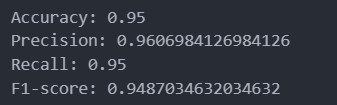
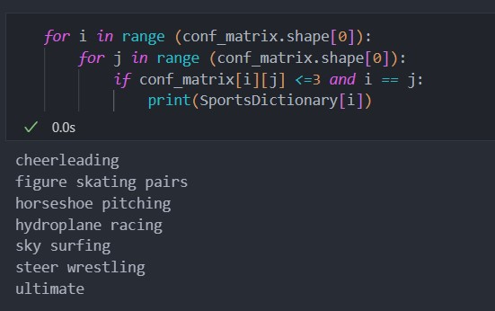

# SportsClassification
This project is a classification endeavor that aims to distinguish among 100 different sports classes. The classification is performed based on images or videos using a fine-tuned ResNet50 model. 
## In the case of videos
frames are extracted and each frame is individually labeled. The final label for the video is determined based on the most frequently predicted label across all frames.
Please note that due to the potentially large number of frames, this process may be time-consuming. However, the duration can be reduced by decreasing the number of frames analyzed.
## Project Structure
```bash
├───code
│       sportclassification-mobilenetv2.ipynb
│       sportclassification-resnet50.ipynb
│       sportclassification-resnet50_Testing.ipynb
│
├───Images
│       MobileNetv2-FT.png
│       MobileNetv2-TL.png
│       MobileNetv2_EvalMeasures.jpg
│       ResNet-CM.png
│       ResNet-FT.png
│       ResNet-TL.png
│       ResNet50_EvalMeasures.jpg
│       TheClassesThatClassifiesWrong.jpg
│       TheClassesThatClassifiesWrong_MobileNetv2.jpg
│       trainingDataDistribution.png
│
└───WebApp
    │   App.py
    │   requirements.txt
    │   utilities.py
    │
    ├───static
    │       2.jpg
    │       3.jpg
    │       4.jpg
    │       5.jpg
    │
    └───templates
            Home.html
            Image.html
            Video.html
```

## Resultson The test set

### Evaluation measures

 

### The classes that are most frequently misclassified:

 

## Links
[Model File](https://drive.google.com/file/d/1IT078Kf8Kq8uG53_fBEVVObxjbEkfO_w/view?usp=sharing)

[Demo](https://drive.google.com/file/d/1FZen-7H7K8Me7XHVLZMBgcOXoAXF1rxG/view?usp=sharing)
